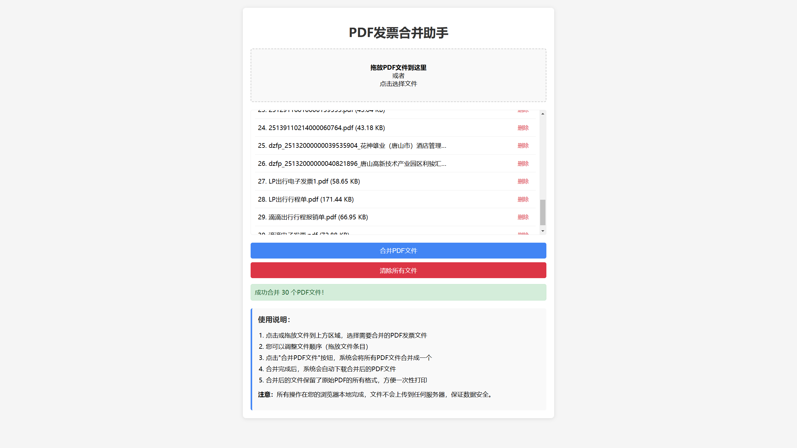

# pdf-merger

这是一个PDF发票合并助手工具，你可以直接在浏览器中使用，不需要安装任何软件。这个工具有以下功能：

- 支持拖放或点击选择多个PDF文件
- 显示已选文件列表，可以随时删除不需要的文件
- 可以通过拖拽调整PDF文件的合并顺序
- 一键合并所有PDF文件并自动下载
- 所有操作在浏览器本地完成，不会上传文件到任何服务器，保证数据安全

#### 使用方法：

点击或拖放文件到上传区域，选择你的PDF发票
根据需要调整文件顺序（通过拖拽文件项目）
点击"合并PDF文件"按钮
合并完成后，系统会自动下载合并后的PDF文件
现在你就可以一次性打印所有发票了

这个工具使用了纯前端技术，包括PDF-lib.js和FileSaver.js库，完全在你的浏览器中运行，确保文件安全。合并后的PDF文件保留了原始文档的所有格式和布局，适合直接打印使用。

